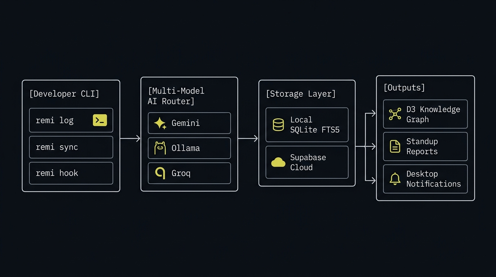
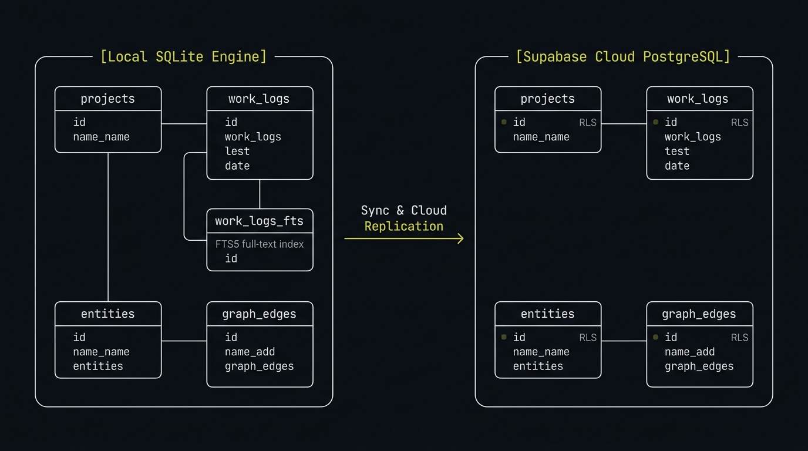
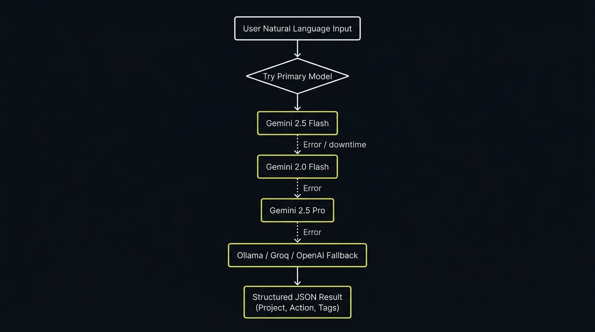

<div align="center">

```text
██████╗ ███████╗███╗   ███╗██╗
██╔══██╗██╔════╝████╗ ████║██║
██████╔╝█████╗  ██╔████╔██║██║
██╔══██╗██╔══╝  ██║╚██╔╝██║██║
██║  ██║███████╗██║ ╚═╝ ██║██║
╚═╝  ╚═╝╚══════╝╚═╝     ╚═╝╚═╝

   v1.0.5  REMI CLI • Autonomous Project Memory & Work Graph
  A Zaarvy Ecosystem Package
```

**Autonomous developer work memory, smart Git synchronization, AI standup reporting, and interactive D3 knowledge graph.**

[](https://zaarvy.in/packages/remi)
[](https://www.npmjs.com/package/zaarvy-remi)
[](https://opensource.org/licenses/MIT)
[](https://github.com/Ujjwal3115/zaarvy-remi/pulls)
[](https://zaarvy.in)

<br /><br />


</div>

---

## Overview

Developers often lose context across complex codebases, multiple branches, and fast-moving sprints. Writing manual standup reports or tracking past achievements interrupts deep work.

**REMI** runs silently in developer environments. It hooks into Git workflows to extract structured project memory from commit history, accepts natural language work logs, generates executive-ready AI standup reports, and renders an interactive glassmorphic knowledge graph connecting your projects, tech stacks, and team members.

- **Local-First by Default:** Fast embedded SQLite engine with Full-Text Search 5 (FTS5). Works 100% offline.
- **Multi-Model AI Router:** Orchestrates local privacy-first models (Ollama) and cloud APIs (Google Gemini 2.5 Flash, Groq, OpenAI).
- **Git Native:** Autonomous post-commit hooks log work without manual intervention.
- **Visual Intelligence:** D3.js force-directed physics graph rendered locally in your browser.

---

## Quick Start

### Global Installation via NPM

```bash
npm install -g zaarvy-remi
```

### Run Setup Wizard

Initialize storage preferences and AI provider keys via the interactive wizard:

```bash
zaarvy-remi setup
```

*(You can also use `remi` as a direct CLI alias for all commands).*

---

## Core Capabilities

### 1. Dual-Mode Work Logging (`remi log`)
Log your engineering progress through natural language or strict scriptable flags.

- **AI Natural Language Mode:**
  ```bash
  remi log "Integrated Stripe webhooks with exponential backoff on Remi API"
  ```
  REMI automatically determines the project name, summarizes the outcome, and tags technologies (`Stripe`, `Webhooks`, `Node.js`).

- **Strict Flag Mode (Zero AI Overhead):**
  ```bash
  remi log -p "Zaarvy Engine" -m "Optimized SQLite FTS5 tokenization query" -t "SQLite, Performance, FTS5"
  ```

### 2. Interactive Knowledge Graph (`remi graph`)
Launches a local HTTP server and opens an interactive D3.js force-directed graph in your default browser.
- Explores relationships across **Projects**, **Tech Tags**, and **Contributors**.
- Features light and dark theme toggling, search filtering, zoom/pan physics, and a slide-out detail inspector.

### 3. Smart Git Commit Sync (`remi sync`)
Ingests past Git repository history directly into REMI memory without duplicate logs.
```bash
remi sync --limit 100
```
Extracts commit authors, timestamps, and intelligent tech tags from commit diffs and messages.

### 4. Automated Git Hook (`remi hook install`)
Install a zero-overhead Git `post-commit` hook in your current repository:
```bash
remi hook install
```
Every `git commit` you make is automatically analyzed and stored in REMI memory silently.

### 5. AI Standup & Weekly Reports (`remi standup`)
Eliminate morning status meeting prep with synthesized summaries:
```bash
# Generate Daily Standup (past 24-48 hours)
remi standup --days 1

# Generate Weekly Sprint Summary (past 7 days)
remi standup --days 7
```
Outputs formatted Markdown sections ready to paste into Slack, Discord, Linear, or Jira.

### 6. Developer Stats & Coding Heatmap (`remi stats`)
Terminal dashboard providing real-time visibility into engineering velocity:
- Active consecutive day streak counter.
- 30-day ASCII activity heatmap.
- Top technologies and languages used by log frequency.
- Distribution breakdown partitioned across active projects.

### 7. Proactive Desktop Reminders (`remi schedule`)
Native background daemon that notifies you if you have not logged any progress during your workday:
```bash
# Test native OS desktop notification toast
remi schedule --test

# Run background reminder daemon
remi schedule
```

### 8. Full-Text Search (`remi search`)
Instant keyword search across all stored logs powered by SQLite FTS5:
```bash
remi search "webhook"
```

---

## CLI Command Reference

| Command | Arguments / Flags | Description |
| :--- | :--- | :--- |
| `remi setup` | `--reset` | Run interactive wizard to configure DB and AI providers. |
| `remi log` | `"<text>"` or `-p -m -t` | Record work via AI natural language or strict flags. |
| `remi graph` | `--port <num>` | Launch the interactive D3 web knowledge graph. |
| `remi sync` | `--limit <n>`, `--all` | Ingest commits from current Git repo into memory. |
| `remi standup` | `--days <n>`, `--project <p>` | Generate AI Daily or Weekly standup report. |
| `remi stats` | `--days <n>` | Display streak counter, project breakdown, and heatmap. |
| `remi schedule` | `--test`, `--interval <m>` | Configure and test proactive desktop notifications. |
| `remi search` | `"<query>"` | Full-Text search across work log history. |
| `remi export` | `-p <project>`, `--json` | Export project logs to Markdown or JSON format. |
| `remi hook install` | `--uninstall` | Manage Git `post-commit` automatic logging hook. |

---

## Technical Architecture

<div align="center">
  
</div>

REMI is engineered with clean separation between CLI interfaces, storage abstraction, and intelligence routers:

### 1. Local-First SQLite & Cloud Supabase Storage
<div align="center">
  
</div>

- **Primary Local Storage:** `better-sqlite3` embedded at `~/.remi/remi.db`.
- **FTS5 Virtual Indexing:** Fast BM25 ranking across messages, project names, and technology tags.
- **Cloud Backend (Optional):** Supabase PostgreSQL integration for multi-device synchronization and remote team collaboration.

### 2. Multi-Model AI Router & Fallback Chain
<div align="center">
  
</div>

- **Provider Priority:** Ollama (Local) -> Google Gemini (Cloud Default) -> Groq (High Speed) -> OpenAI.
- **Failover Strategy:** If the configured provider encounters rate-limiting or network issues, REMI gracefully attempts fallback or prompts for flag-based logging.

---

## Configuration & Environments

REMI stores its global configuration file at:
- **Windows:** `%USERPROFILE%\.remi\config.json`
- **macOS / Linux:** `~/.remi/config.json`

Supported environment variables:

| Variable | Description |
| :--- | :--- |
| `GEMINI_API_KEY` | Google Gemini API Key (Gemini 2.5 Flash default). |
| `GROQ_API_KEY` | Groq API Key (Llama 3.3 70B Versatile). |
| `OPENAI_API_KEY` | OpenAI API Key (GPT-4o-mini / GPT-4o). |
| `OLLAMA_BASE_URL` | Local Ollama endpoint (Default: `http://localhost:11434`). |
| `SUPABASE_URL` | Supabase project URL for cloud database syncing. |
| `SUPABASE_KEY` | Supabase Anon or Service Key for remote sync. |

---

## Contributing to Open Source

We welcome contributions from the open-source developer community!

### Local Development Setup

1. **Fork and Clone:**
   ```bash
   git clone https://github.com/Ujjwal3115/zaarvy-remi.git
   cd zaarvy-remi
   ```

2. **Install Dependencies:**
   ```bash
   npm install
   ```

3. **Link for Local Development:**
   ```bash
   npm link
   ```
   Now `remi` and `zaarvy-remi` will execute your local source files directly.

4. **Run Verification & Tests:**
   ```bash
   npm test
   ```

### Contribution Guidelines
- Ensure PRs maintain clean ASCII aesthetics (no unnecessary emojis in terminal output).
- Verify cross-platform compatibility across Windows, macOS, and Linux.
- Run tests before opening a pull request.

---

## License

This project is licensed under the [MIT License](LICENSE).

Developed and maintained by [Zaarvy](https://zaarvy.in).
